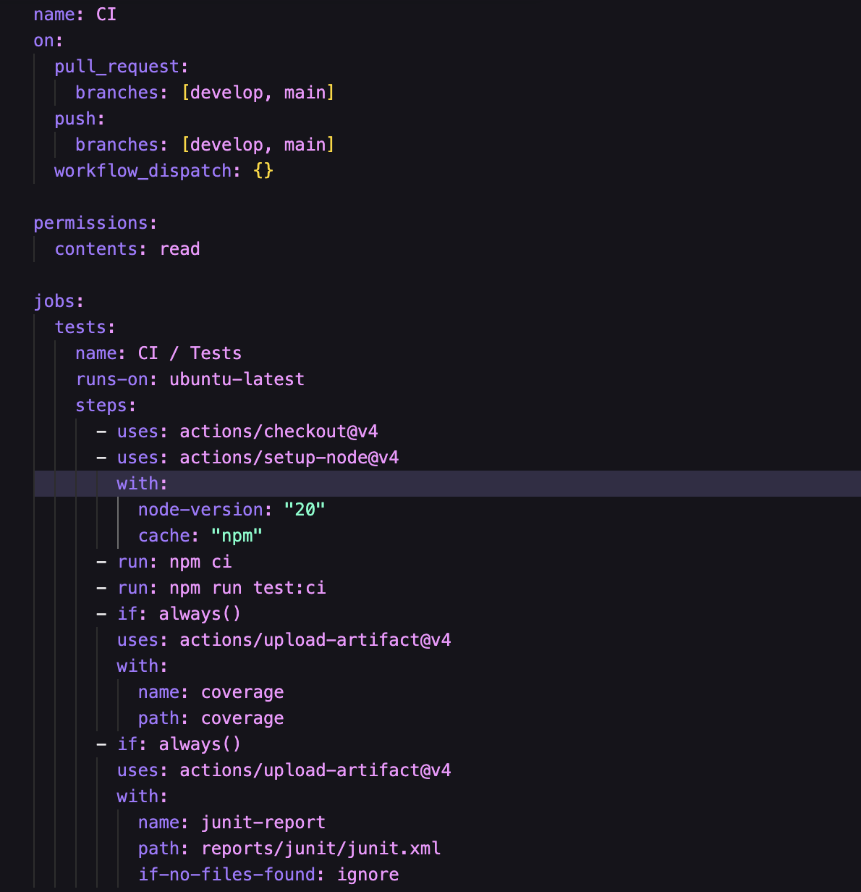

# Maths Functions Library

Repositorio: [https://github.com/TITANRAH/prueba2-actividad1](https://github.com/TITANRAH/prueba2-actividad1)

Una biblioteca de funciones matemáticas construida con Next.js, TypeScript y Jest, con pipeline de CI/CD automatizado.

## Características

- Funciones matemáticas: suma, resta, multiplicación, división, potencia, raíz cuadrada, verificación de paridad
- Testing completo con Jest y cobertura del 100%
- CI/CD pipeline con GitHub Actions
- Status checks obligatorios para merge seguro
- TypeScript para type safety
- Next.js 15 con App Router

## Getting Started

### Instalación

```bash
npm install
```

### Desarrollo

```bash
npm run dev
```

Abre [http://localhost:3000](http://localhost:3000) en tu navegador para ver el el sitio.

## Testing

### Ejecutar tests

# Tests con coverage

npm run test:ci

````

### Cobertura de código

- Statements: 100%
- Branches: 100%
- Functions: 100%
- Lines: 100%

### Funciones testeadas

- `suma(a, b)` - Suma dos números
- `resta(a, b)` - Resta dos números
- `multiplicacion(a, b)` - Multiplica dos números
- `division(a, b)` - Divide dos números
- `potencia(a, b)` - Eleva un número a una potencia
- `raiz(a)` - Calcula la raíz cuadrada de un número
- `isPar(a)` - Verifica si un número es par

## CI/CD Pipeline

### ¿Qué es este pipeline?

El pipeline es como un robot que se encarga de verificar que el código funcione correctamente cada vez que hago cambios, para esta actividad 1 hicimos algunas pruebas matematicas y creamos rama main y develop

### ¿Cuándo se ejecuta?

El robot se activa automáticamente en estas situaciones:

- Cuando creas un Pull Request hacia `develop` o `main`
- Cuando haces push directo a `develop` o `main`
- Cuando lo ejecutas manualmente (útil para pruebas)

### Status Checks

- "CI / Tests" es un status check obligatorio
- No se puede hacer merge hasta que pasen todos los tests
- Cobertura del 100% requerida para merge
- Branch protection activa en `develop` y `main`

### ¿Cómo funciona el archivo YML?

El archivo `.github/workflows/ci.yml` lo entiendo como un paso a paso que le dice al robot qué hacer. Aquí te explico cada parte:

#### Configuración del trigger (¿Cuándo se activa?)
```yaml
on:
  pull_request:
    branches: [develop, main]    # Se activa en PRs hacia estas ramas
  push:
    branches: [develop, main]    # Se activa en push directo a estas ramas
  workflow_dispatch: {}          # Permite ejecución manual
````



#### Pasos que ejecuta el robot:

1. Checkout del código - El robot descarga tu código más reciente
2. Setup Node.js 20 - Prepara el entorno de JavaScript
3. Instalación de dependencias - Instala todas las librerías necesarias
4. Ejecución de tests - Corre todos los tests para verificar que funcione
5. Upload de artifacts - Guarda los reportes de coverage y tests

#### ¿Por qué es importante?

- Detecta errores antes de que lleguen a producción
- Mantiene la calidad del código
- Ahorra tiempo al equipo de desarrollo
- Previene bugs en el código final

## Branch Protection

- Require PR: Solo se permite merge a través de Pull Requests
- Status Checks: Tests obligatorios antes del merge
- Up to date: Las ramas deben estar actualizadas
- Force push: Bloqueado para mantener integridad

## Estructura del Proyecto

```

prueba2-actividad1/
├── .github/workflows/ # GitHub Actions workflows
│ └── ci.yml # Pipeline de CI/CD
├── libs/ # Biblioteca de funciones
│ └── maths.ts # Funciones matemáticas
├── tests/ # Tests unitarios
│ └── maths.spec.ts # Tests de funciones matemáticas
├── coverage/ # Reportes de cobertura
├── reports/ # Reportes de tests
└── app/ # Aplicación Next.js

```

## Tecnologías

- Next.js 15 - Framework de React
- TypeScript - Tipado estático
- Jest - Framework de testing
- GitHub Actions - CI/CD pipeline
- ts-jest - Preset de Jest para TypeScript

## Learn More

- [Next.js Documentation](https://nextjs.org/docs) - learn about Next.js features and API.
- [Learn Next.js](https://nextjs.org/learn) - an interactive Next.js tutorial.

You can check out [the Next.js GitHub repository](https://github.com/vercel/next.js) - your feedback and contributions are welcome!

## Contribución

### Flujo de trabajo

1. Crear una rama desde `develop`
2. Desarrollar tu funcionalidad
3. Agregar tests para nueva funcionalidad
4. Crear Rama `feat/ fix/ etc`
5. Crear Pull Request hacia `develop`
6. Esperar que pasen los status checks
7. Merge después de los status checks

### Requisitos

- ✅ Todos los tests deben pasar
- ✅ Cobertura del 100% mantenida
- ✅ Sin conflictos de merge
- ✅ Code review aprobado

## Deploy

### Otros proveedores

Consulta la [documentación de deployment de Next.js](https://nextjs.org/docs/app/building-your-application/deploying) para más detalles.

```

```
